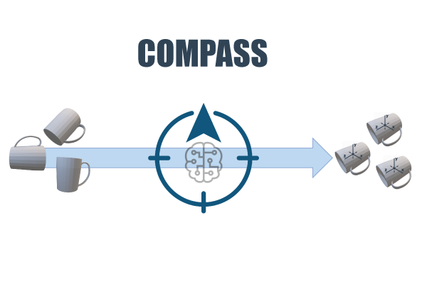

# Learning to Orient Surfaces by Self-supervised Spherical CNNs
Repository containing the code of "Learning to Orient Surfaces by Self-supervised Spherical CNNs", accepted to [NeurIPS 2020](https://neurips.cc/). WIP.

[[Paper]](https://arxiv.org/abs/2011.03298) - [[Video]]() - [[Poster]](assets/poster_nips.pdf)

### Authors
[Riccardo Spezialetti](https://www.unibo.it/sitoweb/riccardo.spezialetti/) - Federico Stella - Marlon Marcon - Luciano Silva - [Samuele Salti](https://vision.deis.unibo.it/ssalti/) - [Luigi Di Stefano](https://www.unibo.it/sitoweb/luigi.distefano/)

<p align="center">
  
</p>

## Installation
Before start, make sure that all dependencies are installed. The simplest way to do so, is to use [anaconda](https://www.anaconda.com/).
You can create an anaconda environment called `compass` using
```
conda env create -f requirements.yml
conda activate compass
```

### Instal external dependencies
Install lie-learn:
```bash
git clone https://github.com/AMLab-Amsterdam/lie_learn
cd lie_learn
python setup.py install
```
Install spherical-cnns:
```bash
git clone https://github.com/jonas-koehler/s2cnn.git
cd s2cnn
python setup.py install
```

### Instal and Test Spherical Voxelization
```bash
# Install pybind
sudo apt-get install python-pybind11
```

```bash
cd  utils/spherical_voxel/
python3 setup.py develop
# The test will fail
python3 -m unittest utils/test_geometry.py 
```

## How To
Before training or testing, include the absolute path of the repo in the `PYTHONPATH` environment variable:
```
export PYTHONPATH="<path_to_compass>"
```
Note: the code is meant to run on a CUDA-capable GPU using PyTorch. If you do not have a CUDA GPU you can set the `--use_gpu` option of the following scripts to 0 and execute on CPU only, but the execution times will higher by orders of magnitude. Executing the code without a GPU is advised for testing purposes only.

### Training
Before starting to train, execute:
```
python -m visdom.server -p 8888
```
This will start a Visdom server, accessible at `localhost:8888` to monitor the training. If you use a different port, remember to specify it in the following scripts with `--port_vis`.

To train a new network from scratch on 3DMatch, run:
```
python apps/train_compass.py --config_file configs/train_3dm.yaml --name_train <name> --path_log <path to log dir> --path_ds <path to dataset> --name_file_folder_train <CSV file with training split> --name_file_folder_validation <CSV file with val split>
```
In `configs` there are pre-configured settings for StanfordViews and ETH as well.

To produce the test-time adaptation you need to load a base model (e.g. trained with 3DMatch) and train it with the config file corresponding to the dataset you want to adapt to, specifying the additional command line arguments to load the base model:
```
--path_ckp_ts <path to ts file of base model> --path_ckp_s2_layer <path to s2 layer> --path_ckp_lrf_layer <path to lrf layer>
```
In `apps/train_compass.py` you can find additional command line arguments to set.

### Test
To test the network, run:
```
python apps/lrf_benchmark.py --config_file configs/test_3dm.yaml --path_results <path to save results> --path_ds <path to single test scene> --path_ckp_layer_s2 <path to s2 layer of the network> --path_ckp_layer_lrf <path to lrf layer> 
```
In `configs` there are pre-configured settings for StanfordViews and ETH as well.

You can also set `--is_batch` to `0` to enable the visualization of point clouds, keypoints and extracted supports.

In `apps/lrf_benchmark.py` you can find additional command line arguments to set.

## Pretrained Models
Pretrained models are available for download:
| Training |  zip |
|:-:|:--:|
| 3DMatch | [weights](https://github.com/CVLAB-Unibo/compass/tree/master/pretrained_models/basemodel) |
| 3DMatch, adapted with ETH | [weights](https://github.com/CVLAB-Unibo/compass/tree/master/pretrained_models/adaptation_eth) |
| 3DMatch, adapted with StanfordViews | [weights](https://github.com/CVLAB-Unibo/compass/tree/master/pretrained_models/adaptation_stanfordviews) |
| ModelNet40 | [weights](https://github.com/CVLAB-Unibo/compass/tree/master/pretrained_models/modelnet40) |

## Citation
If you find this code useful in your research, please cite:
```
@article{spezialetti2020learning,
  title={Learning to Orient Surfaces by Self-supervised Spherical CNNs},
  author={Spezialetti, Riccardo and Stella, Federico and Marcon, Marlon and Silva, Luciano and Salti, Samuele and Di Stefano, Luigi},
  journal={Advances in Neural Information Processing Systems},
  volume={33},
  year={2020}
}
```

## License
Code is licensed under Apache 2.0 License. More information in the `LICENSE` file.

## Acknowledgements
Parts of our code are from other repositories:
* [https://github.com/jonas-koehler/s2cnn](https://github.com/jonas-koehler/s2cnn)
* [https://github.com/qq456cvb/PRIN](https://github.com/qq456cvb/PRIN)
* [https://www.lfd.uci.edu/~gohlke/code/transformations.py.html](https://www.lfd.uci.edu/~gohlke/code/transformations.py.html)
